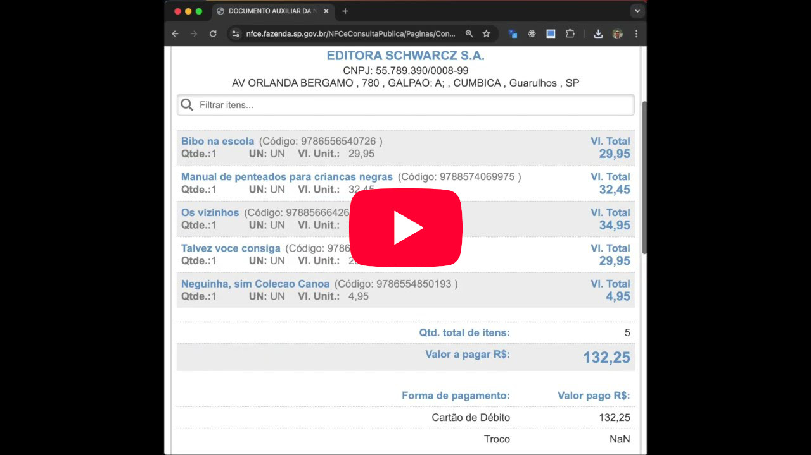

## NFCE_TO_CSV

Plugin Chrome para gerar, a partir dos sites dos estados da NFCe, um csv com _descrição, código, quantidade e valor total_ dos produtos comprados

## Motivação

Uma conhecida queria, após a [Festa do Livro da USP](https://festadolivro.edusp.com.br/), apurar as compras feitas para prestação de contas, que antes deste plugin era feito manualmente.

## Estados disponíveis

 [São Paulo](exemplos/sp1.jpeg)

 [Espirito Santo](exemplos/es1.jpg)

 [Santa Catarina](exemplos/sc1.jpg)

 [Pernanbuco](exemplos/pe1.webp)

 [Maranhão](exemplos/ma1.webp)

## Carregar e Testar o Plugin

1. Abra o Chrome e vá para [chrome://extensions/](chrome://extensions/)
2. Ative o Modo do desenvolvedor.
3. Clique em Carregar sem compactação e selecione a pasta [Exportacao_Notas_Fiscais_Plugin](Exportacao_Notas_Fiscais_Plugin/) onde os arquivos do plugin estão.
4. No card entitulado _Exportação de Notas Fiscais_ clique em **Saiba mais**
5. Ative o item **Fixar na barra de ferramentas** ( vai aparecer o ícone do plugin na barra do chrome  )
6. Acesse o site da nota fiscal, passe pelo CAPTCHA manualmente e clique no ícone do plugin para fazer o download do CSV.

## Estado Atual e Proximos Passos

O código em si é bem simples e não segue nenhhum [design pattern](https://refactoring.guru/design-patterns), sinta-se a vontade para sugerir melhoria seguindo as opções do [tópico](#help-wanted).

Algo nescessário é ter exemplos de NFCe de todos os estado, ficaria grado de receber-los para embasar o desenvolvimento. Segue meu [contado](https://github.com/roremeol).

Tenho a idéia de colocar o leitor de QR dentro do plugin, pois em devices com câmeras (Notes, Tablets, Celulares, ...), ficari tudo em um só lugar.

Outro ponto seria a possibilidade de exportação em outro formatos. Por exemplo, em excel podería incluir o nome da da empresa e cnpj como "páginas" e possibilitar multiplas "leituras" antes do download do arquivo gerado.

Melhorar o ícone

## HELP WANTED!!

Se você gostou do plugin, ou se tem interesse em contribuir, sinta-se livre para enviar uma PR, ou apenas ajudar com as discussoes nos Issues abertos.
